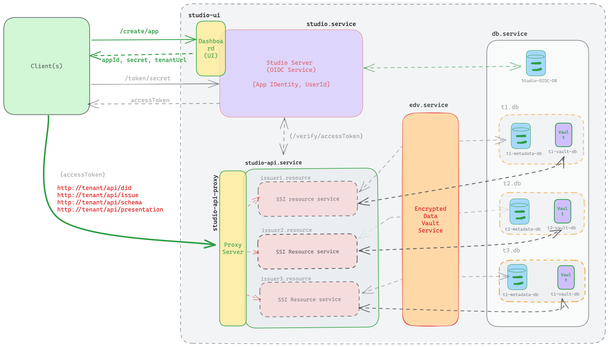

```bash
studio-cli git:(master) ✗ ./bin/run.js --help                     

Hypersign Issue Node Infrastructure CLI

VERSION
  studio-cli/0.0.0 darwin-arm64 node-v16.20.1

USAGE
  $ studio-cli [COMMAND]

COMMANDS
  clean    Stop and Delete Hypersign issuer node infrastructure
  help     Display help for studio-cli  
  setup    Setup configurations for Hypersign issuer node infrastructure
  start    Start Hypersign issuer node infrastructure
  stop     Stop Hypersign issuer node infrastructure
```
